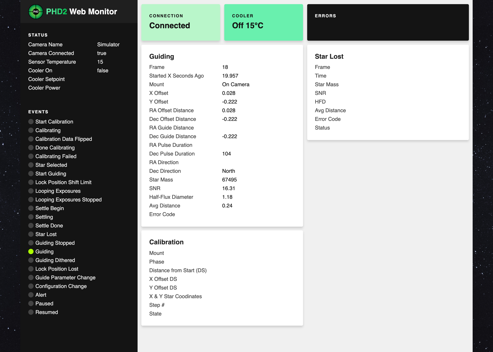

# PHD2 Web Monitor

Asynchonous web monitor for PHD2 Guiding.

Listens to ```localhost``` on port ```4400``` which is the default port for PHD2. Will eventually have a config file to set this.



## Requirements
Python 3.6+

## Installation
Running from the command line
```bash
python3 -m venv env
pip install -r requirements.txt
cd app
uvicorn main:app
```

Running with Docker
```bash
docker build -t phdweb .
docker run --name phdwebcontainer -d -p 80:8000 phdweb
```

## Usage
Navigate to localhost:8000 to view the webpage.
